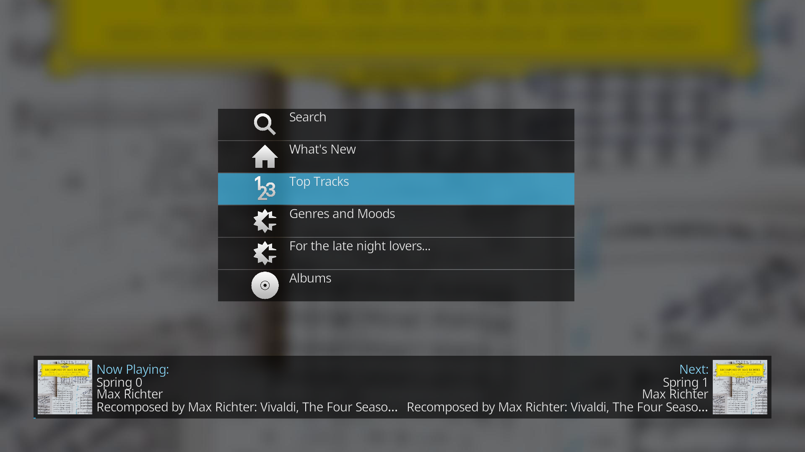

Generating player menus
=======================

.. IMPORTANT::

    This code is a work in progress and may therefore lack some of the \
    functionality that you may encounter on more 'professional' applications.

    If there is some functionality that is missing (or the code otherwise \
    works in unexpected ways) then please notify me in the \
    `GitHub issues tracker <https://github.com/elParaguayo/LMSTools/issues>`_.

The :class:`LMSMenuHandler <LMSTools.menu.LMSMenuHandler>` class allows you \
to generate squeezeplayer menus on the fly. This will allow you to create your \
own interfaces in your applications.

.. NOTE::

    The purpose of this class is to allow you to generate menus for your own \
    applications.

    It does **not** generate menus for hardware squeezeplayers i.e. these are \
    still provided by the server.

An example menu (running in a Kodi script):

Understanding the menu system
-----------------------------

Menus are provided by the server as JSON objects. At their most basic, they \
provide text, icon path and the relevant command to be executed.

This library currently categorises each menu item into one of four types:

- :class:`NextMenuItem <LMSTools.menuitems.NextMenuItem>`: a menu item which \
  just provides an additional submenu;
- :class:`PlaylistMenuItem <LMSTools.menuitems.PlaylistMenuItem>`: a menu item \
  which can be played/added to playlist or can provide a subsequent menu \
  showing the tracks in the playlist;
- :class:`AudioMenuItem <LMSTools.menuitems.AudioMenuItem>`: a menu item \
  which can be played/added to playlist; and
- :class:`SearchMenuItem <LMSTools.menuitems.SearchMenuItem>`: a menu item \
  which requires user input before providing results.

The use of these different menu types is set out further below.

Creating a menu handler
-----------------------

The menu handler is currently included as a separate class. As the menus are \
specific to each player, the menu handler must have information about the player \
for which the menu is being requested.

.. code-block:: python

    >>>from LMSTools import LMSServer, LMSMenuHandler
    >>>server = LMSServer("192.168.0.1")
    >>>laptop = server.get_players()[1]
    >>>handler = LMSMenuHandler(laptop)
    >>>

If you wish to create a menu for a different player then you can change the \
current player as follows:

.. code-block:: python

    >>>livingroom = server.get_players()[0]
    >>>handler.changePlayer(livingroom)
    >>>

Generating a menu
-----------------

To simplify the process of creating a menu, the menu handler has a a built in\
function to retrieve the home menu: :func:`getHomeMenu \
<LMSTools.menu.LMSMenuHandler.getHomeMenu>`.

.. code-block:: python

    >>>home = handler.getHomeMenu()
    >>>home
    [<LMSTools.menuitems.NextMenuItem at 0x7f049a0de490>,
     <LMSTools.menuitems.NextMenuItem at 0x7f049a0de450>,
     <LMSTools.menuitems.NextMenuItem at 0x7f049a0de9d0>,
     <LMSTools.menuitems.NextMenuItem at 0x7f049a0de510>,
     # etc.
     ]

Custom menus
------------

As you can see from the above, the default home menu is very large and may be \
unwieldy for your own application.

As a result, you may want to define your own menu and have the menu handler \
process this menu.

.. code-block:: python

    CUSTOM_MENU = {
        "count": 5,
        "item_loop": [{
            "node": "myMusic",
            "weight": 11,
            "text": "Artists",
            "actions": {
                "go": {
                    "cmd": ["browselibrary", "items"],
                    "params": {
                        "menu": 1,
                        "mode": "artists",
                        "role_id": "ALBUMARTIST,ARTIST,BAND,COMPOSER,CONDUCTOR,TRACKARTIST"
                    }
                }
            },
            "icon": "html/images/artists.png"
        }, {
            "node": "myMusic",
            "text": "Albums",
            "actions": {
                "go": {
                    "cmd": ["browselibrary", "items"],
                    "params": {
                        "menu": 1,
                        "mode": "albums"
                    }
                }
            },
            "id": "myMusicAlbums",
            "icon": "html/images/albums.png"
        }, {
            "node": "myMusic",
            "text": "Playlists",
            "icon": "html/images/playlists.png",
            "actions": {
                "go": {
                    "cmd": ["browselibrary", "items"],
                    "params": {
                        "menu": 1,
                        "mode": "playlists"
                    }
                }
            }
        }, {
             "node": "myMusic",
             "text": "Search",
             "icon": "html/images/search.png",
             "actions": {
                "go": {
                    "cmd": ["browselibrary", "items"],
                    "params": {
                        "menu": 1,
                        "mode": "search"
                    }
                }
            }
        }, {
            "node": "home",
            "window": {
                "titleStyle": "album",
                "icon-id": "plugins/MyApps/html/images/icon.png"
            },
            "text": "My Apps",
            "actions": {
                "go": {
                    "player": 0,
                    "cmd": ["myapps", "items"],
                    "params": {
                        "menu": "myapps"
                    }
                }
            }
        }]
        }

    menu = LMSMenuHandler(player)
    results = menu.getCustomMenu(CUSTOM_MENU)
    for item in results:
        print item.text, item.cmd

should output the following

.. code-block:: python

    Artists ['browselibrary', 'items', 0, 1000, 'menu:1', 'mode:artists', 'role_id:ALBUMARTIST,ARTIST,BAND,COMPOSER,CONDUCTOR,TRACKARTIST']
    Albums ['browselibrary', 'items', 0, 1000, 'menu:1', 'mode:albums']
    Playlists ['browselibrary', 'items', 0, 1000, 'menu:1', 'mode:playlists']
    Search ['browselibrary', 'items', 0, 1000, 'menu:1', 'mode:search']
    My Apps ['myapps', 'items', 0, 1000, 'menu:myapps']

Navigating the menu
-------------------

Next Menu items
~~~~~~~~~~~~~~~

NextMenuItems' purpose is to take the user to another menu. The object \
therefore provides the necessary command required to generate the next menu:

.. code-block:: python

    >>>next = home[0]
    >>>menu = handler.getMenu(next.go())
    >>>

Playlist Menu items
~~~~~~~~~~~~~~~~~~~

In addition to providing a submenu (i.e. a list of the tracks in the playlist) \
a playlist meny item can be played/added to the queue.

.. code-block:: python

    >>># Assume this is a playlist menu item!
    >>>playlist = home[0]
    >>>playlist.play()
    >>>

See the :class:`PlaylistMenuItem <LMSTools.menuitems.PlaylistMenuItem>` class \
documentation for more information.

Audio Menu items
~~~~~~~~~~~~~~~~

These behave the same as Playlist Menu items (with the exception that they \
don't provide a submenu of playable tracks).

Search Menu items
~~~~~~~~~~~~~~~~~

These items require user input to deliver tailored responses.

.. code-block:: python

    >>># Assume this is a search menu item!
    >>>searchitem = home[0]
    >>>cmd = searchitem.search("My search term")
    >>>results = handler.getMenu(cmd)
    >>>
